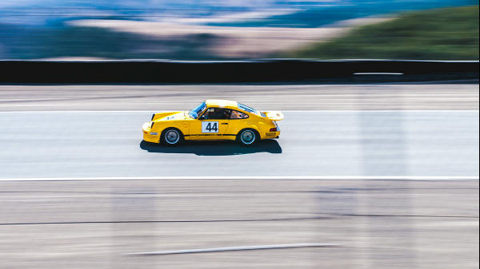

# wyvern
A command-line image processing tool written in Rust.

## Features:
- Image downscaling (50% downscaling only for now)
    - Batch image downscaling of a directory of images
- Fast approximate k-means clustering to get the 'common colors' of an image, output as a new image
- Edge detection
- Pixel sorting with an option to select the 'direction' of the sorted pixels
- Denoising using nearest-neighbor averages
- Greyscale conversion

## Supported file formats
The following indicates image formats that have been verified with `wyvern`.
| Fule format    | Support verified? |
| --------       | -------           |
| JPEG           |:white_check_mark: |
| PNG            |:white_check_mark: |
| BMP            |:x:                |
| TIFF           |:x:                |


## Some examples of various commands

### Downscale a single image
The new downscaled image will be saved under _\path\to\image_downscaled_
```
    wyvern downscale "\path\to\image"
```



### Batch downscale a directory of images
The output of this command will be saved under a new directory _\path\to\directory\resized_images_. Note that you must provide the file format of the images in this directory you want downscaled after the path to the directory.
```
    wyvern batch-downscale "\path\to\directory" png
```

### Return set of common colors in an image
The output is saved under _\path\to\image_common_colors_.
Note, the output is non-deterministic, so feel free to re-run as get better results!
```
    wyvern common-colors "\path\to\image"
```


### Generate new image highlighting the edges of an image
The new image will be saved under _\path\to\image_edges_
```
    wyvern edge-detect "\path\to\image"
```


### Pixel sort an image
This will pixel sort and save the output under _\path\to\image_pixelsorted_
```
    wyvern pixel-sort "path\to\image"
```


### Convery an image to greyscale
This will denoise a given image and save the denoised output under _\path\to\image_denoised_
```
    wyvern greyscale "path\to\image"
```


### More info
For a complete accounting of each command and the optional arguments you can provide, be sure to use the '--help' argument on each command as follows:
```
    wyvern --help # see all wyvern commands
    wyvern pixel-sort --help # see arguments and flags each command has available to it
```